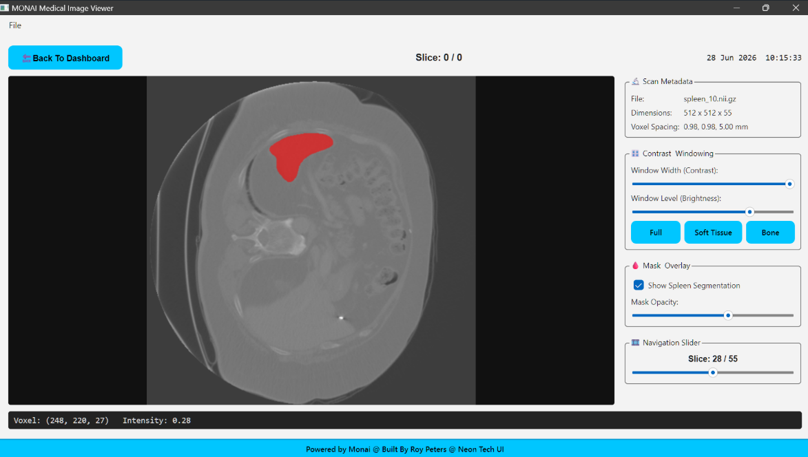
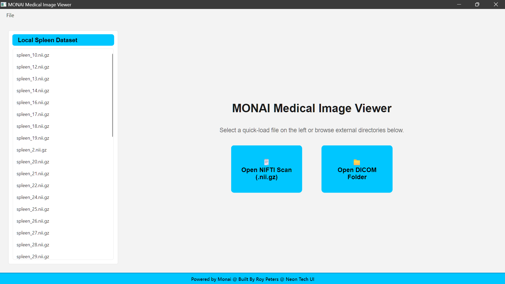
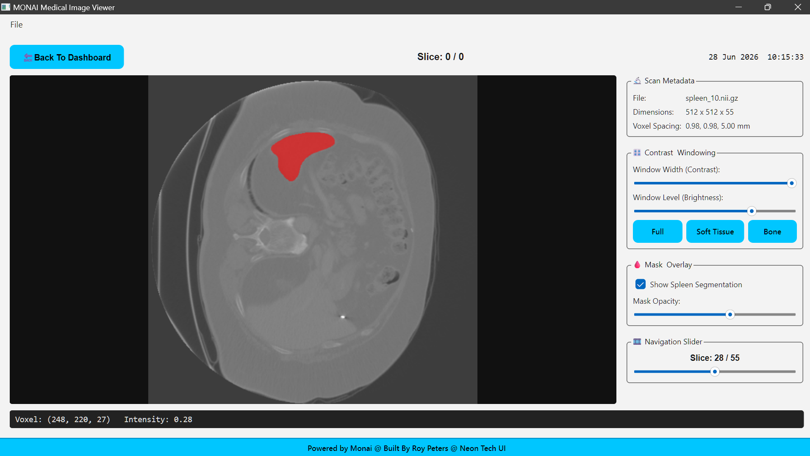

# 🩻 MONAI Medical Image Viewer


The MONAI Medical Image Viewer is a desktop tool built for developers, students, and researchers who want a simple, fast, and visually polished way to inspect:
- NIfTI (.nii / .nii.gz) medical volumes
- DICOM folder series
- MONAI sample datasets (e.g., MSD Spleen)
- Version 1 focuses on usability, clarity, and a modern neon‑tech UI — making it easy to browse local datasets, load scans, inspect slices, and view segmentation masks.

---

## 🎥 Demo
[](demo.mp4)

---

## 📸 Screenshots
- Main UI

- Main UI of the image viewer


---

## ✨ Features (Version 1)
### 🧭 Welcome Dashboard
- Auto‑detects local MONAI datasets

- Neon‑styled buttons for NIfTI and DICOM loading

- Clean sidebar listing available spleen scans

---

### 🖼️ Image Viewer
- Load NIfTI volumes using MONAI or Nibabel

- Automatic segmentation mask detection (labelsTr)

- Slice navigation slider + mouse wheel support

- CT window/level controls (contrast + brightness)

- Preset modes: Full, Soft Tissue, Bone

- Mask overlay with adjustable opacity

- Live telemetry bar showing voxel intensity + (X,Y,Z)

- Real‑time clock in the top navigation bar

- Neon‑themed UI throughout

---

### 🎨 UI Design
- Vibrant Neon Tech theme

- Black text on neon cyan buttons

- Neon section headers

---

## 📂 Project Structure
```python
monai_medical_image_viewer/
│
├── monai_ui/
│   ├── main_window.py        # App shell + footer + neon theme
│   ├── welcome_widget.py     # Dashboard + dataset browser
│   ├── image_widget.py       # Viewer + controls + overlays
│
├── monai_utils/
│   ├── loaders.py            # MONAI + Nibabel + DICOM loaders
│   ├── transforms.py         # Placeholder for future transforms
│
├── data/
│   ├── spleen/               # MONAI MSD Spleen dataset
│   └── sample.nii.gz         # Example volume
|
├── tests/                    # Pytest suite
|   ├── conftest.py        
│   ├── test_welcome_widget_logic.py     
│   ├── test_loaders.py
|   ├── test_main_window_logic.py        
│   ├── test_ui_smoke.py     
│   ├── test_welcome_widget_logic.py
|
├── viewer.py                 # App entry point
├── monai_data.py             # Monai spleen dataset
└── README.md                 # Project documentation
```

---

## 🚀 Getting Started
### Install dependencies
```bash
pip install -r requirements.txt
```
### Run the viewer
```bash
python viewer.py
```
### Optional: Download MONAI Spleen dataset
```bash
python monai_data.py
```
- This downloads and extracts Task09_Spleen automatically.

---

## 🧪 Supported Formats
Format	Description
- NIfTI (.nii / .nii.gz)	3D medical volumes (CT/MRI)

---

## 🛣️ Roadmap (Version 2+)

- [ ] User‑to‑user image sharing from the UI  
Allow users to select a loaded scan or slice and send it directly to other users through a built‑in sharing panel (email, export, or messaging integration).

- [ ] DICOM download via TCIA

- [ ] Zoom + pan tools

- [ ] Multi‑view (axial / sagittal / coronal)

- [ ] Thumbnail preview in dashboard

- [ ] Full neon theme for sliders + group boxes

---

### 💡 Credits

**Built by Roy Peters** 😊
linkedin badge
[](https://www.linkedin.com/in/roy-p-74980b382/)